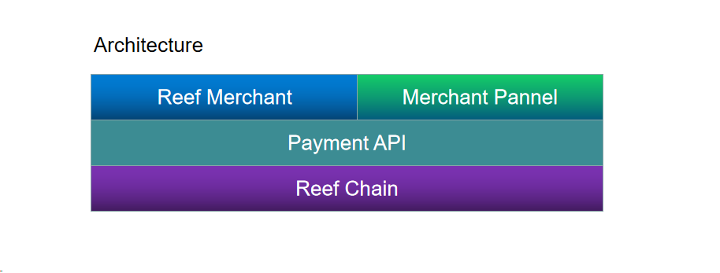

# Reef Merchant Payment
Reef-merchant-payment is a hackathon project for building a web payment API on Reef chain.

- Hackaton link: https://gitcoin.co/issue/reef-defi/reef-finance-bounties/1/100026837

## Components
- Reef Merchant

    Reef Merchant includes a payment UI and backend that uses payment API to display payment address and payment confirmation.

- Merchant Pannel

    Merchant registration, merchant control panel features and usability.

- Payment API

    Payment API, payment address generation, payment process, payment result webhook notification.

 ## Deployed websites and API service on AWS
 - Merchant

    Payment UI: http://47.243.16.81/merchant

    Backend: http://47.243.16.81:8000

- Merchant Pannel

    http://47.243.16.81

- Payment API

    http://47.243.16.81:9001

## YouTube Demo
https://youtu.be/yuvcoeiGnu8

## License
The applicable license is MIT.

